# MOLECULAR ADSORPTION BY SURFACE MAPPING ALGORITHM

For a given pair of atomic structures, the present algorithm generates sets of
adsorbed configurations, considering ridge structures and atoms as spheres of
VDW radius (which could overlap regulated). First, a surface mapping is
performed, than, based on the mapping the adsorption are performed.

#### Surface Mapping

The objective of this step is to get a set of K points on the surface of each molecule, these points must represent the diversity of different chemical environments around the molecule:

- 1) Read the mol and associate VDW radii for each atom:
    There are VDW radii for some atoms and their reference, but others can be
    added manually, search for "VDW RADII AND ITS REF" in this document.

- 2) Both molecule surfaces are mapped with dots:
    The surface of a molecule is an outside surface built with the union of  ridge spheres of VDW radii around each atom. The files mol_a_surf.xyz and mol_b_surf.xyz present this data [a]. Points in these spheres (SO2) are obtained with the algorithm describedby Deserno (see the article "How to generate equidistributed points on the surface of a sphere", https://www.cmu.edu/biolphys/deserno/pdf/sphere_equi.pdf).

- 3) Featurize, clusterize and find representative dots among the surface dots.
    For each point of the surface, features are extracted. The features vector contains the sorted distances from the point to each atom of the molecule, separated by the chemical element of the atoms. Based on a K-means clustering, the surface dots are clusters/groups, and the point nearest to the centroid of its clusters is selected as its representative point in the molecular surface. The files mol_a_km.xyz and mol_b_km.xyz present this data [a].

| Input structures (*.xyz)   | 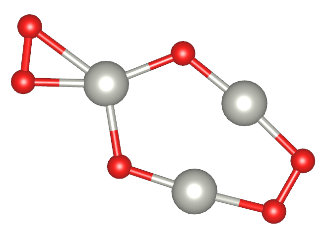      | 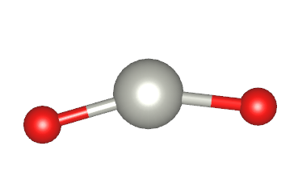
|---------------------------|-------------------------------|---------------------------
| Surface dots (*_surf.xyz)         | 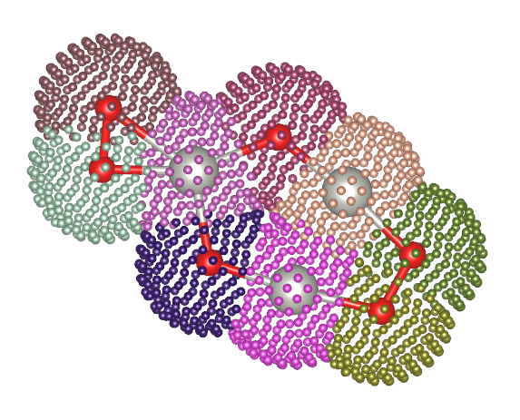 | 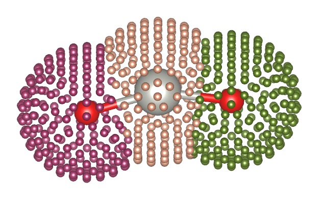
| Surface dots clustering (*_km.xyz) | 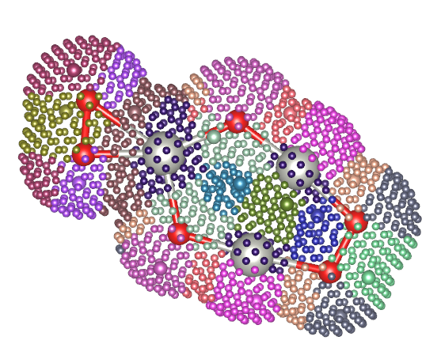   | 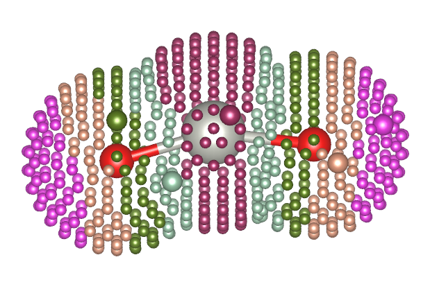
| Clustering in t-SNE reduced features | 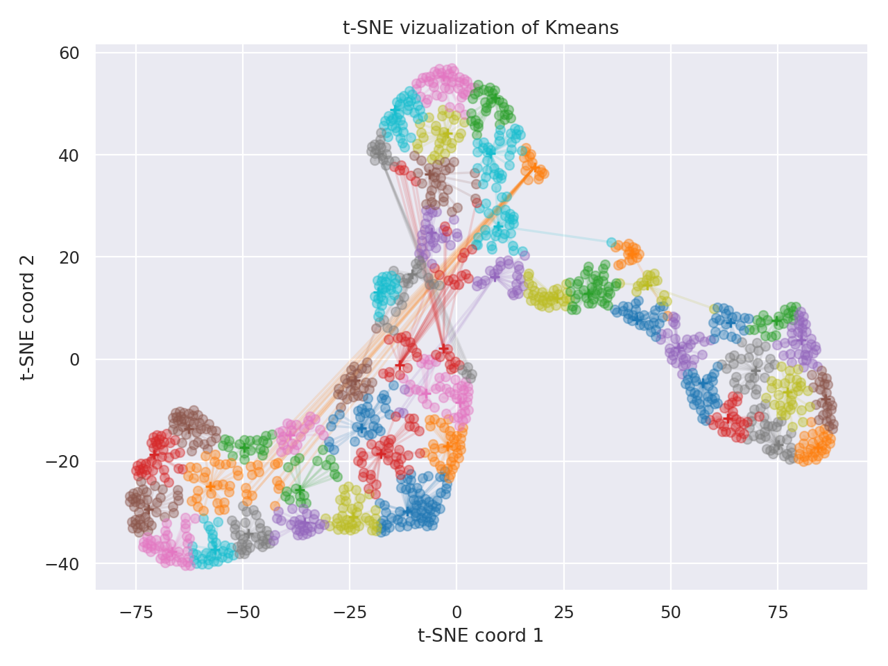 | 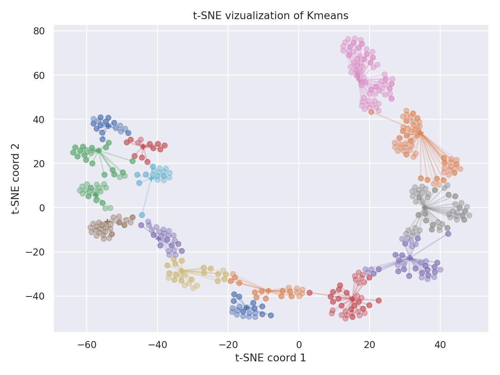

The \*_surf.xyz files present the surface dots with a color for the points associated with each atom. The \*_km.xyz files present the surface dots with a color for the points associated with each cluster of surface dots. Similar colors of different figure have no relation with each other.

The structure with the surface dots can be seen in the VESTA code.To correct read their data, you must replace the VESTA configuration file *elements.ini* with the *elements.ini* file added in the present project. These files present the types of atoms, colors, and other properties to automatically add colors to the representation.

#### Adsorption

The objective of this step is to obtain a pull with many and diverse adsorbed structures. Adsorption is performed by combining both molecules by each pair of the representative point of its surfaces. Moreover, for each pair of representative points, many rotations are performed to guarantee good matches between the molecules. These rotations are performed with a grid of rotations of SO3, obtained with a method called Successive Orthogonal Images on SOn. The method was first presented by Mitchell ([DOI:10.1137/030601879](https://doi.org/10.1137/030601879)), but for the present implementation I followed the paper by Yershova ([DOI:10.1177/0278364909352700](https://doi.org/10.1177/0278364909352700)). Note that, the number of adsorbed molecules configurations to analyze is deterministic and is the product of the number of surface clusters for each molecule and the number of rotations in SO3.

A configurations is added to a pull when:
 - The molecules did not overlap in the adsorption, which is considered to have happened when a pair of atoms of different molecules were distant by less than the sum of their VDW radii multiplied by the parameter ovlp_threshold;

 - The present structures is not similar to any one in the in the pull of structure, which is verify with a simple filtering. The adsorbed configurations are featurized with a method similar to the surface points. First, the distances between three key points and each atom are calculated and sorted, keeping separations by each atom type and key point. The key points are the geometrical center of each molecule and the position of the representative surface dots that were employed to create the present configuration. If the euclidian distance between the present configuration and all other structures in the pull were smaller than sim_threshold parameter.

Example structures:

| 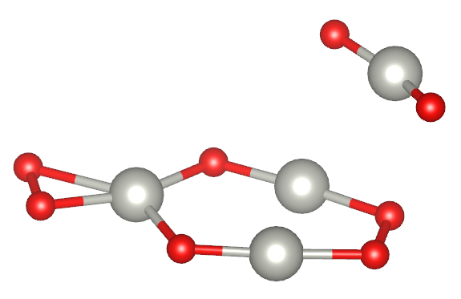 | 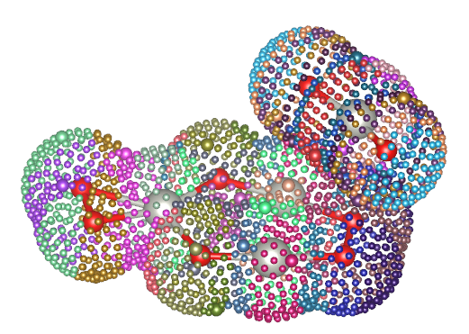
|---------------------|-----------------------------|
| 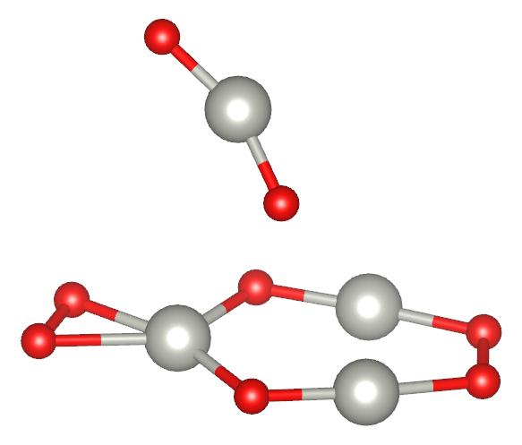 | 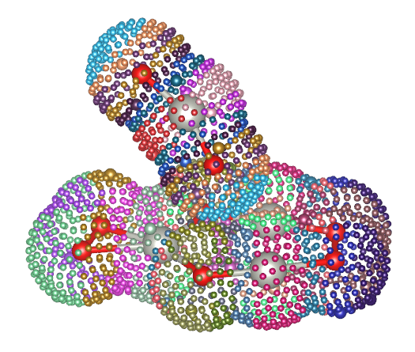
| 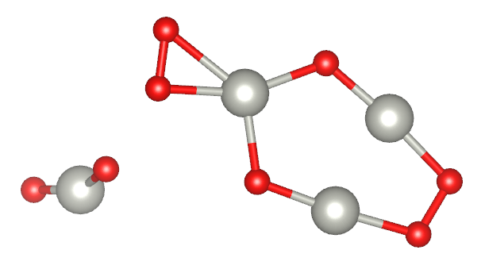 | 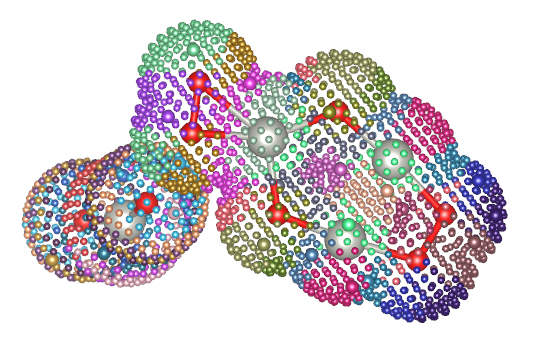

## Representative set sampling

Finaly, the structures in poll are clusterized with K-means yielding a representative set. The structures are written in folder_xyz_files (adsorbed structures) and folder_xyz_files_withsurfs (adsorbed structures with surface information).
A vizualization of the clustering process is indicated in the file clustering_representatives*.png.

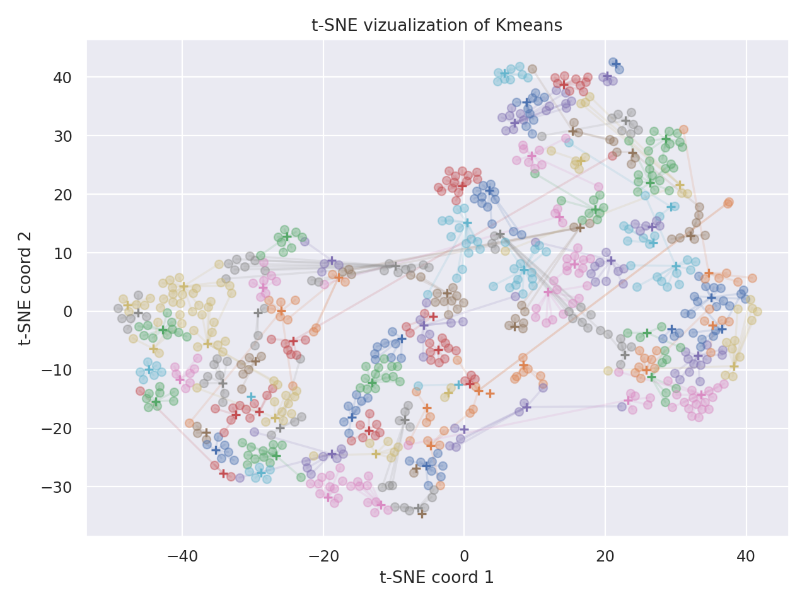

## Runnig the code

Example with required arguments:
```bash
$ cd example
$ python ../adsorption.py --mols cluster.xyz molecule.xyz --surf_ks 20 10 --n_final 100
```

Example with all arguments:
```bash
$ cd example
$ python ../adsorption.py --mols cluster.xyz molecule.xyz --surf_ks 30 10 --n_final 100 --surf_d 10 --n_repeat_km 20 --n_rot 100 --ovlp_threshold 0.90 --sim_threshold  0.04 --out_sufix _2
```

<!-- ```bash
$ python the_script.py top_folder
``` -->
<!-- Esse script, atualmente, procura todas as pastas começando na pasta do argumento e analiza todas as pastas que tiverem dentro dela

- Ignora as pastas os com status **ok** (o nome da pasta termina em **\*_ok**);

- Ignora as pastas que não tenham os arquivos basicos de um cálculo do *orca*;

- Analiza as pastas que tenha arquivos **\*.xyz**, **\*.imp**, e **slurm-\*.out**:
  - Copia a esturtura do arquivo **\*.xyz** para o arquivo **\*.imp**;

  - Lê os arquivos **slurm-\*.out**, e verifica se o último arquivo apresenta a mensagem de convergência -->
