# MOLECULAR ADSORPTION BY SURFACE MAPPING ALGORITHM

The present algorithm generates sets of atomic structures of adsorbed molecules, considering ridge structures and atoms as spheres of VDW radius (or a fraction of it).

| A.xyz 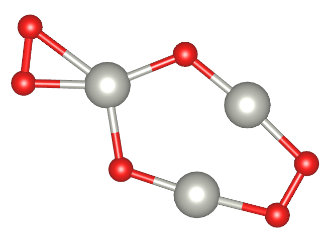  | **+** | B.xyz 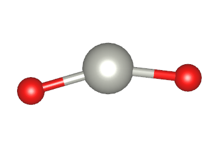 | **>>>** | AB_1.xyz 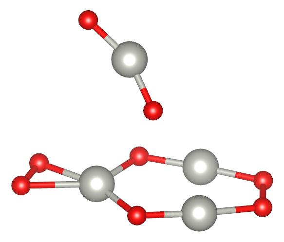  AB_2.xyz 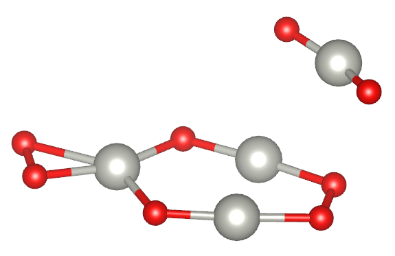 ... |
|----------------------------------|-------|----------------------------------|-----|------------------------------------------------------------------|

## Methodology

Our methods mimic the ideia that two melecules could interact based on different chemical environments on the surface of the molecules. First, it get a representative sets of chemical environments of each one of the molecules. Second, we find structures combining the molecules through each possible pair of chemical environments in the molecules. Finally, this poll of structures is sampled to find a representative set of thepossible ways of interaction.

#### Surface Mapping

The objective of this step is to get a set of K points on the surface of each molecule, these points must represent the diversity of different chemical environments around the molecule:

- Read the mol and associate VDW radii for each atom:
    There are VDW radii for some atoms (and their reference), but one can add VDW raddi manually, search for "add_your_vdw_radii_here" in the *adsorption.py* file.

- Both molecule surfaces are mapped with dots:
    The surface of a molecule is an outside surface built with the union of  ridge spheres of VDW radii around each atom. The files mol_a_surf.xyz and mol_b_surf.xyz present this data [a]. Points in these spheres (SO2) are obtained with the algorithm describedby Deserno (see the article "How to generate equidistributed points on the surface of a sphere", https://www.cmu.edu/biolphys/deserno/pdf/sphere_equi.pdf).

- Featurize, clusterize and find representative dots among the surface dots.
    For each point of the surface, a feature vector is calculated as presented in the image below. The feature vector present an entry per atom. The order of the entries is sorted by chemical element and distances from the reference point in the surface to the atom. Then, based on a K-means clustering employed with these features data, the surface dots are grouped. The groups represent regions with similar chemical environment. The surface point with the features nearest to the mean feature values of each cluster is selected as a representative point in the molecular surface. The files mol_a_km.xyz and mol_b_km.xyz present this data [a].

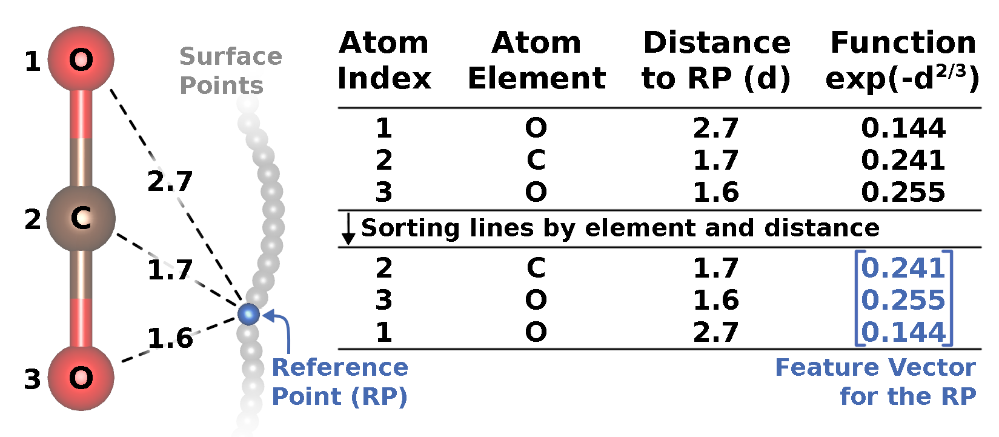

###### The files written during the surface mapping:

| Input structures (*.xyz)   |       | 
|---------------------------|-------------------------------|---------------------------
| **Surface dots (*_surf.xyz)**          | 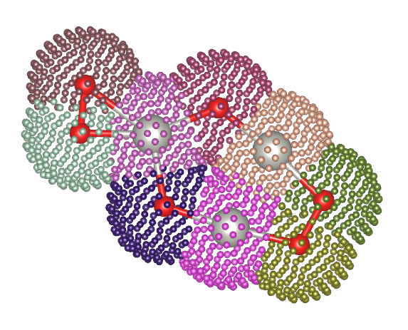 | 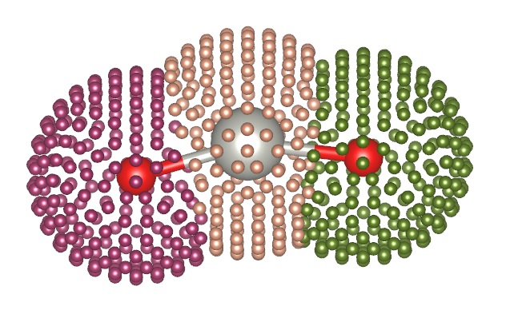
| **Surface dots clustering (*_km.xyz)** | 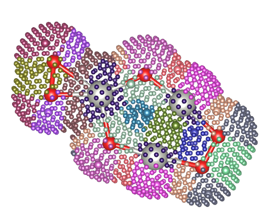   | 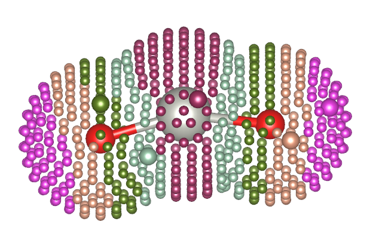
| **Clustering in t-SNE reduced features** | 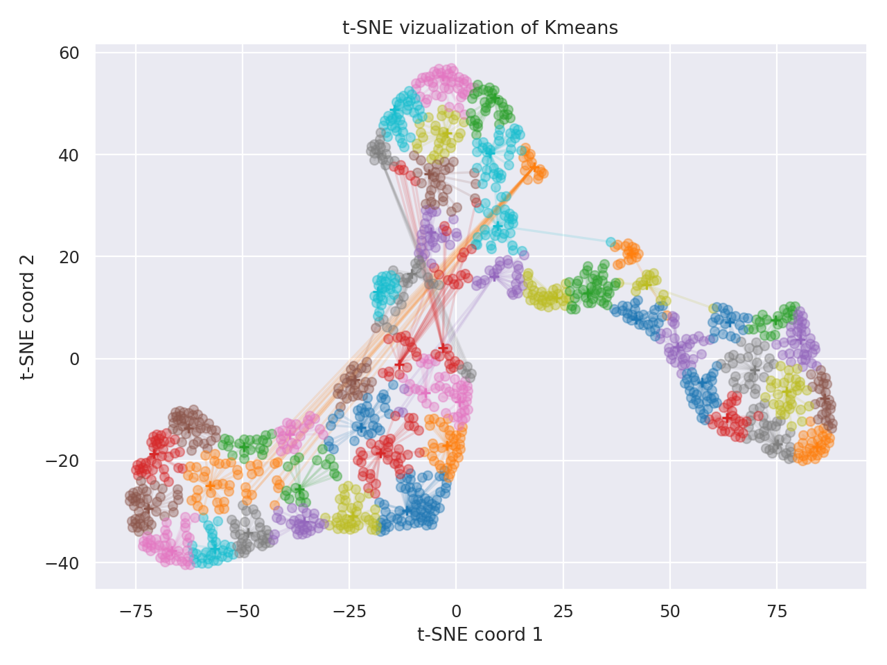 | 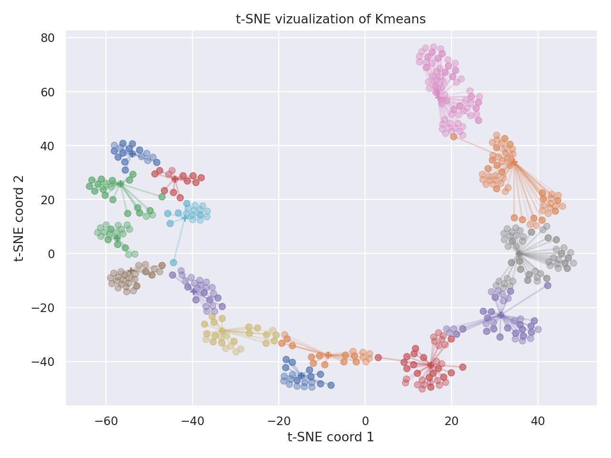

The \*_surf.xyz files present the surface dots with a color for the points associated with each atom. The \*_km.xyz files present the surface dots with a color for the points associated with each cluster of surface dots. Similar colors of different figure have no relation with each other.

The structure with the surface dots can be seen in the [VESTA](https://jp-minerals.org/vesta/en/download.html) code. To correct read their data, you must replace the VESTA configuration file *elements.ini* with the *elements.ini* file added in the present project. These files present the types of atoms, colors, and other properties to automatically add colors to the representation.

#### Adsorption

The objective of this step is to obtain a pull with many and diverse adsorbed structures. Adsorption is performed by combining both molecules by each pair of the representative point of its surfaces. Moreover, for each pair of representative points, many rotations are performed to guarantee good matches between the molecules. These rotations are performed with a grid of rotations of SO3, obtained with a method called Successive Orthogonal Images on SOn. The method was first presented by Mitchell ([DOI:10.1137/030601879](https://doi.org/10.1137/030601879)), but for the present implementation I followed the paper by Yershova ([DOI:10.1177/0278364909352700](https://doi.org/10.1177/0278364909352700)). Note that, the number of adsorbed molecules configurations to analyze is deterministic and is the product of the number of surface clusters for each molecule and the number of rotations in SO3.

A configurations is added to a pull when:
 - The molecules did not overlap in the adsorption, which is considered to have happened when a pair of atoms of different molecules were distant by less than the sum of their VDW radii multiplied by the parameter ovlp_threshold. The parameter in general is above 0.90 and is important to guarantee that a adsorbed configurations generated are plausible.

 - The present adsorbed configuration should be different to any other adsorbed configuration in the pull of structures, which is verify with a simple filtering. The filtering is based on the euclidian distance between a feature vector for the present adsorbed configuration and all others feature vectors for the structures in the pull were larger than sim_threshold parameter, the present structure will be included in the pull. For each adsorbed configuration a feature vector is calculated as presented in the figure below.

    Note that this feature vector is equivalant to the concatenation of three feature vectors similar as the ones calated for suface points but only one reference point is on the surface. Two reference points are in the geometrical center of the molecules seapartedly. The last reference point is the position were the two representative surface dots are combined to create the present adsorbed configuration. The parameter must be setted acording to each pair of structures and is important to avoid overrpresenting some regions of the space of adsorption configurations.


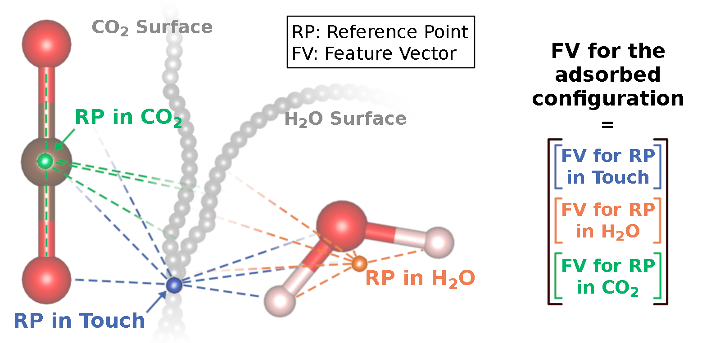

Example of adsorbed structures:

|  | 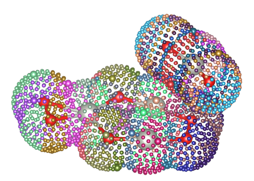
|---------------------|-----------------------------|
|  | 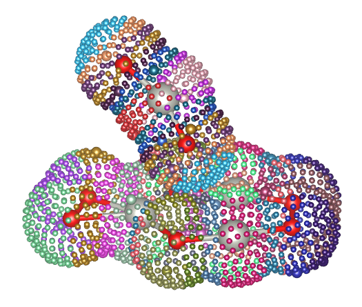
| 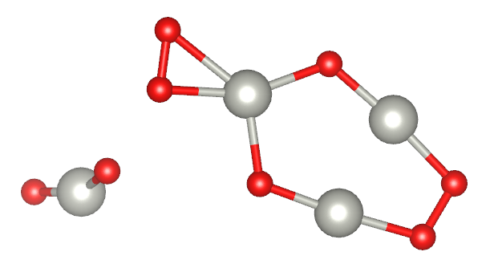 | 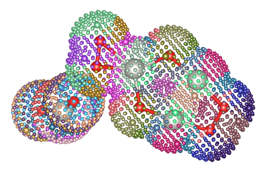

#### Representative set extraction

Finaly, the structures in poll are clusterized with K-means yielding a representative set. The structures are written in folder_xyz_files (adsorbed structures) and folder_xyz_files_withsurfs (adsorbed structures with surface information).
A vizualization of the clustering process is indicated in the file clustering_representatives*.png.

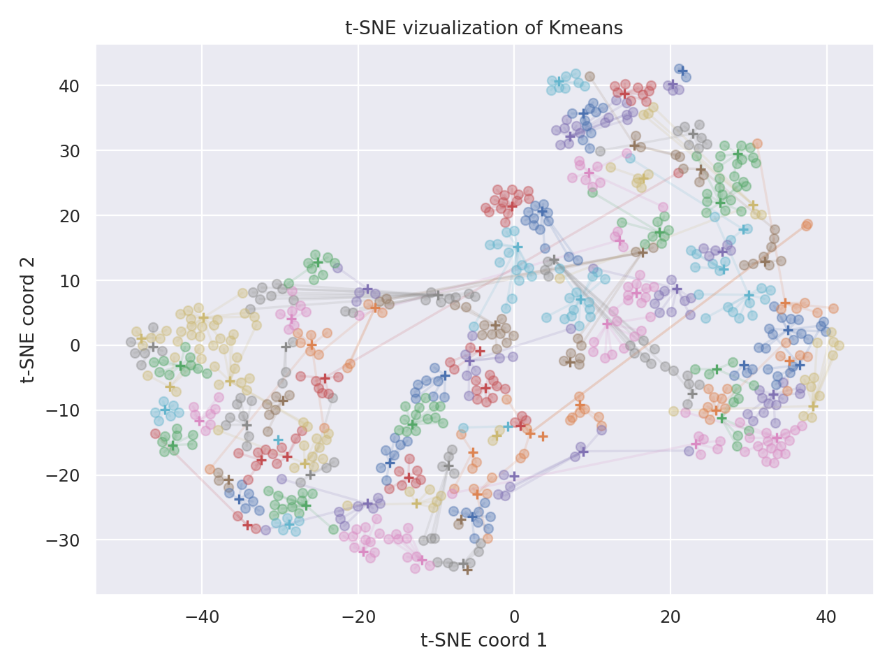

## The code

#### Required packages

- numpy
- scipy
- argparse
- pandas
- sklearn
- matplotlib

#### Running the code

Example with required arguments:
```bash
$ cd example
$ python ../adsorption.py --mols            A.xyz B.xyz \\
                          --chem_envs       20 5        \\
                          --n_final         50
```

Example with all arguments:
```bash
$ cd example
$ python ../adsorption.py --mols            A.xyz B.xyz \\
                          --chem_envs       20 5        \\
                          --n_final         50          \\
                          --n_rot           60          \\
                          --surf_d          10          \\
                          --n_repeat_km     20          \\
                          --ovlp_threshold  0.95        \\
                          --sim_threshold   0.04        \\
                          --out_sufix       _teste
```

## Comparison of representative sets

The script comparison.py allow to compare multiple sets of adsorbed molecules, for instance, generated with different parameters. It read the molecules in the xyz format, in saparated folders, and get features for they. The features are the same of the employed in the adsorption step described above, if the size of the adsorbed molecules presented in the order of the xyz file. Otherwise, it employs a single key point, the geometric center of the system, which should decrease the quality of the description of the features.

Then, few analysis/plots are performed with this data:
- A histogram of distances among the samples;
- A t-SNE dimensionality reduction;
- A sequence of K-means clustering, increasing K/data size de approximatated 0 a 1.

The results are saved to a file named result_comparison.png:

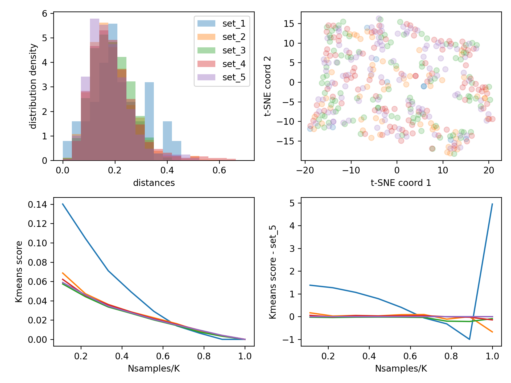

### Running the code

```bash
$ cd example
$ python ../comparison.py --folders set_1 set_2 set_3 set_4 set_5 --subs_ns 9 3
```
